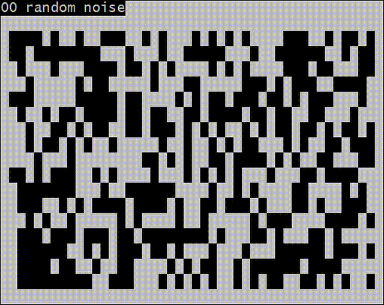

# map_generator

A Python module, written in Rust, that generates 2D, interconnected cave systems. The project is compiled into a Python module using `pyo3`, which allows it to be imported like any other module.

## Example



## Generation steps

- `random noise` The map grid is randomly seeded with empty/wall tiles in an even ratio. The outer edges are always wall tiles.
- `cellular automata` Each tile in the grid is filled if it has more than 4 adjacent wall tiles. Otherwise it becomes empty. This step is applied 64 times.
- `prune` Rooms that are significantly smaller than the largest room are filled in.
- `connect remaining rooms` Paths are drawn between the center tiles of each room. Tiles along each path are set to empty.
- `polish` Also uses cellular automata, except this step opens up narrow passageways. Each wall tile becomes empty if it has >2 empty neighbors.

## Functions

### `generate(height, width)`

Generates a map with a random seed.

```
Parameters:
    height (int): Number of rows in the generated map
    width  (int): Number of columns
     
Returns:
    list(list(int)): The generated map, 
                     each nested list represents a row
    
map_generator.generate(10, 10)
```

### `generate_from_seed(height, width, seed)`

Generates a map from a provided seed. Functions the same as `generate` with an extra parameter.

```
Additional Parameters:
    seed (int): The initial noise will be seeded with this number
    
from os import urandom
with urandom(16) as seed:
    map_generator.generate_from_seed(10, 10, seed)
```

## Requirements

Rust and python package requirements are specified in `Cargo.toml` and `requirements.txt` respectively. Assuming cargo is installed, any missing crates should be acquired automatically when running `build.sh` to compile the project.

Run the following to install Python dependencies beforehand:

```
pip install -r requirements.txt
```

## Importing
```
import sys
sys.path.insert(0, "/path/to/map_generator")

from map_generator import generate, generate_from_seed
```
